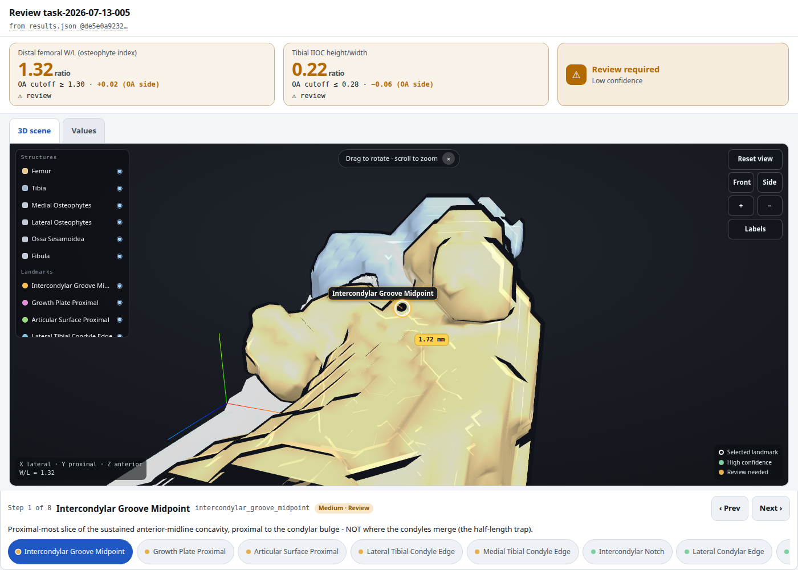
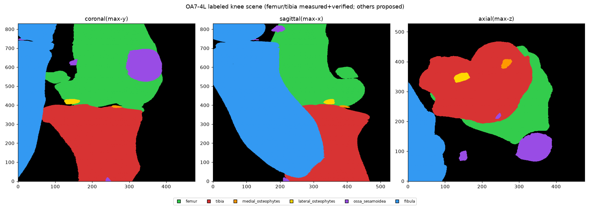
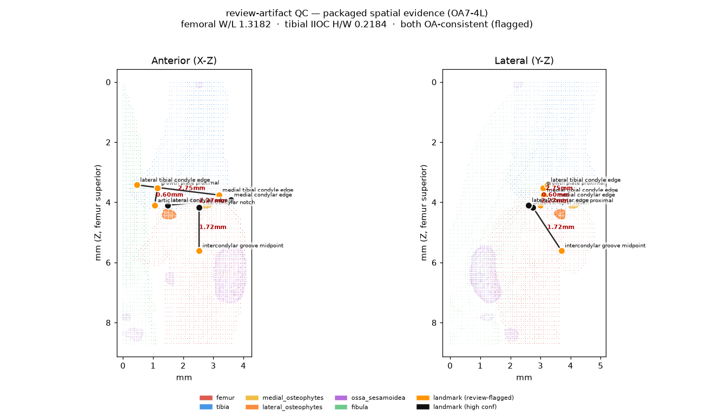

# LabRat

LabRat runs scientific protocols with Claude and records the work so a
researcher can inspect it. The first end-to-end demonstration starts with a
micro-CT scan of a mouse knee and follows a newly published osteoarthritis
measurement method through segmentation, landmark placement, measurement, and
3D review.

Published methods can still be expensive to repeat on a new dataset. The paper
describes the science, while researchers supply many software-level decisions:
how to orient a volume, tune a segmentation, place anatomical landmarks, and
decide whether the result is trustworthy. This project captures that work in
an executable protocol skill. Claude Opus runs the protocol phase by phase,
and a separate Claude session reviews the saved evidence before the run can
continue.



The dashboard keeps uncertain results visible. In the run above, the automated
measurements are marked **Review required** so a researcher can inspect the 3D
geometry and landmarks instead of treating the numbers as ground truth.

## Run the included sample

You need Node.js 24, Claude Science initialized under `~/.claude-science`,
Claude Agent SDK credentials, and `micromamba`. Then:

```bash
git clone https://github.com/haowjy/labrat.git
cd labrat
npm install
cp labrat.config.example.json labrat.config.json
scripts/export-skills-to-claude-science.sh

mkdir -p data/OA7-4L
unzip -n data/OA7-4L.zip -d data/OA7-4L
npm run dev -- enqueue data/OA7-4L microct-oa-mouse-knee
```

The final command starts the run and serves the dashboard at
`http://localhost:4600`. The run writes its task record under `tasks/`. Expect
the micro-CT workflow to take substantially longer than the imaging-free smoke
test:

```bash
npm run smoke
```

The repository's `skills/` directory is the distributable source of truth. The
export command copies those skills into the Claude Science registry, which is
where the current runtime loads them.

## Keep it running

Save machine-specific settings in the gitignored `labrat.config.json`. This
example selects the micro-CT protocol and gives its folder watcher a permanent
drop location:

```json
{
  "defaultModel": "opus",
  "defaultProtocol": "microct-oa-mouse-knee",
  "scienceHome": "~/.claude-science",
  "watchRoots": {
    "microct-oa-mouse-knee": "/absolute/path/to/labrat-inbox"
  },
  "dashboard": { "port": 4600 }
}
```

Run the dashboard and watcher as separate long-lived processes:

```bash
npm run dashboard
```

```bash
npm run dev -- watch
```

Open **Watch folders** in the dashboard and enable ingestion once. That choice
is stored in `control/watcher.json`; after a restart, the watcher resumes the
saved state. New scans go into the watch root's `incoming/` directory. The
watcher moves each one through `in-progress/` and then into `done/` or
`failed/`.

<details>
<summary>Start both processes automatically with systemd</summary>

Create these user services, replacing `/absolute/path/to/labrat` with the
checkout path. `bash -lic` loads the same Node environment used by an
interactive shell, including an NVM-managed Node 24 installation.

`~/.config/systemd/user/labrat-dashboard.service`:

```ini
[Unit]
Description=LabRat dashboard
After=network.target

[Service]
Type=simple
WorkingDirectory=/absolute/path/to/labrat
ExecStart=/usr/bin/bash -lic 'exec npm run dashboard'
Restart=on-failure

[Install]
WantedBy=default.target
```

`~/.config/systemd/user/labrat-watcher.service`:

```ini
[Unit]
Description=LabRat sample watcher
After=network.target labrat-dashboard.service

[Service]
Type=simple
WorkingDirectory=/absolute/path/to/labrat
ExecStart=/usr/bin/bash -lic 'exec npm run dev -- watch'
Restart=on-failure

[Install]
WantedBy=default.target
```

Enable them with:

```bash
systemctl --user daemon-reload
systemctl --user enable --now labrat-dashboard.service labrat-watcher.service
```

Run `loginctl enable-linger "$USER"` if the services should start at boot and
continue after logout. Use `journalctl --user -u labrat-dashboard -u
labrat-watcher -f` to follow their logs.

</details>

## System components

LabRat combines three parts:

1. **Scientific skills and agent roles**

   The included skills define how to inspect 3D medical volumes, execute a
   mouse-knee micro-CT protocol, and construct interactive review artifacts.
   Protocols assign a worker and an independent gate-reviewer, along with
   artifact-building and feedback-routing roles.

2. **Automatic protocol execution**

   The harness ingests a sample, resolves its protocol, runs each phase, applies
   independent review gates, and records the complete run under a task
   directory. Samples can enter through the CLI, the dashboard, or a watched
   folder.

3. **Claude Science skill integration**

   Protocol skills are authored and refined in Claude Science. LabRat uses the
   Claude Science skill format and registry, provides import and export
   commands, and executes registered protocols through the harness. The
   repository vendors the project-specific skills for distribution and review.

## Micro-CT reference protocol

The initial scientific protocol is based on Tang et al., [“Evaluating
Osteoarthritis Severity in Mice Using μCT-Derived Geometric
Indices”](https://pubmed.ncbi.nlm.nih.gov/41677733/) (*Biology*, 2026;15(3):262,
[doi:10.3390/biology15030262](https://doi.org/10.3390/biology15030262)). The
paper defines micro-CT-derived geometric indices for assessing post-traumatic
and age-related osteoarthritis in mice.

The protocol processes a mouse-knee scan through six phases:

```text
intake → segmentation → seed review → landmarks → measurement → final review
```

The workflow segments and orients the knee in 3D, places anatomical landmarks,
computes the published femoral and tibial indices, and preserves the
coordinates and geometry used for each result. Interactive review sites expose
the corresponding 3D anatomy, landmarks, and measurement lines.

### What a run produces

Every phase leaves behind its result, evidence, and review decision. These are
ordinary files under the task directory, so the automated reviewer and the
human-facing dashboard inspect the same record.

**Labeled anatomy after segmentation**



**Landmarks and measurement geometry carried into final review**



The included `OA7-4L` scan is a healthy control from the paper's cohort.
Published values are provided for evaluation and are never used as landmark
targets. See [data/README.md](data/README.md) for sample provenance and reference
measurements.

## Execution and review model

```text
Claude Science authoring
          │
          ▼
Claude Science skill registry ◀── import/export ──▶ vendored skills/
          │
          ▼
Input sample ──▶ worker ──▶ independent gate-reviewer
                    │                    │
                    └── phase outputs and decisions ──┐
                                                      ▼
                                           disk-backed task record
                                                      │
                                                      ▼
                                      3D review + provenance dashboard
                                                      │
                                             accept or send back
                                                      │
                                                      ▼
                                               phase-level rerun
```

Disk is the contract between the harness, agents, and dashboard. Phase outputs,
reviewer verification, human feedback, events, and provenance are written under
the task tree. The dashboard renders that record directly.

The worker and gate-reviewer run in separate sessions behind a trust boundary.
The reviewer cannot alter worker outputs or inspect the worker's private session
state.

## Implemented capabilities

| Capability | Implementation |
|---|---|
| Protocol execution | Declared phases run in order, with review gates between phases. |
| Independent review | A separate gate-reviewer reproduces phase checks and records its own verification. |
| Per-phase 3D review | Micro-CT phases publish rotatable 3D evidence; landmark and measurement phases include overlays. |
| Human correction loop | A researcher can comment, send a phase back, rerun it, and review the returned attempt. |
| Provenance | Phase outputs, gates, session records, events, and human verdicts remain linked on disk. |
| Review export | The dashboard exports the review chain as JSON. |
| Sample ingestion | CLI enqueue, dashboard submission, and folder-watch ingestion are available. |
| Claude Science bridge | Skills can be listed, imported from the registry, and exported from the repository. |

## Skills and roles

The vendored skill set includes:

- [`understand-3d-medical-volume`](skills/understand-3d-medical-volume/) for the
  reusable 3D render, reason, and validation workflow.
- [`microct-oa-mouse-knee`](skills/microct-oa-mouse-knee/) for the Tang et al.
  mouse-knee method and its phase definitions.
- [`review-artifact-builder`](skills/review-artifact-builder/) for sandboxed,
  self-contained review sites.
- [`toy-stats`](skills/toy-stats/) for a fast, imaging-free harness check.

The active agent profiles are declared by each protocol. Files under
[`agents/`](agents/) document the project-level role defaults included with the
Claude plugin.

## Command reference

Useful CLI commands:

```bash
npm run dev -- skills
npm run dev -- import-skill <name> [--force]
npm run dev -- watch
npm run dev -- resume <task-id>
npm run dev -- rerun <task-id> [from-phase]
```

## Current boundaries

- Protocol authoring remains in Claude Science. The LabRat dashboard executes
  and reviews registered protocols.
- The mouse-knee workflow is the first implemented 3D scientific protocol.
  `toy-stats` provides a second runnable protocol for harness validation.
- The paper's geometric indices were developed using severe osteoarthritis
  induced by medial meniscectomy. Their applicability to mild osteoarthritis
  requires further investigation.
- Automatically placed landmarks remain proposals for human review. Numerical
  plausibility does not establish anatomical correctness.
- Human feedback can trigger phase-level reruns. Automatic skill revision from
  aggregated feedback is future work.

## Repository layout

- [`src/`](src/) — execution harness, trust boundaries, dashboard, and CLI
- [`skills/`](skills/) — vendored scientific and review skills
- [`agents/`](agents/) — project-level agent role definitions
- [`data/`](data/) — OA7-4L sample and provenance
- [`validation/`](validation/) — smoke, end-to-end, and trust-boundary checks

LabRat is an open-source Claude plugin built on the Claude Agent SDK. The code
is licensed under the [MIT License](LICENSE). The included sample data is CC BY
4.0 as documented in [data/README.md](data/README.md).
